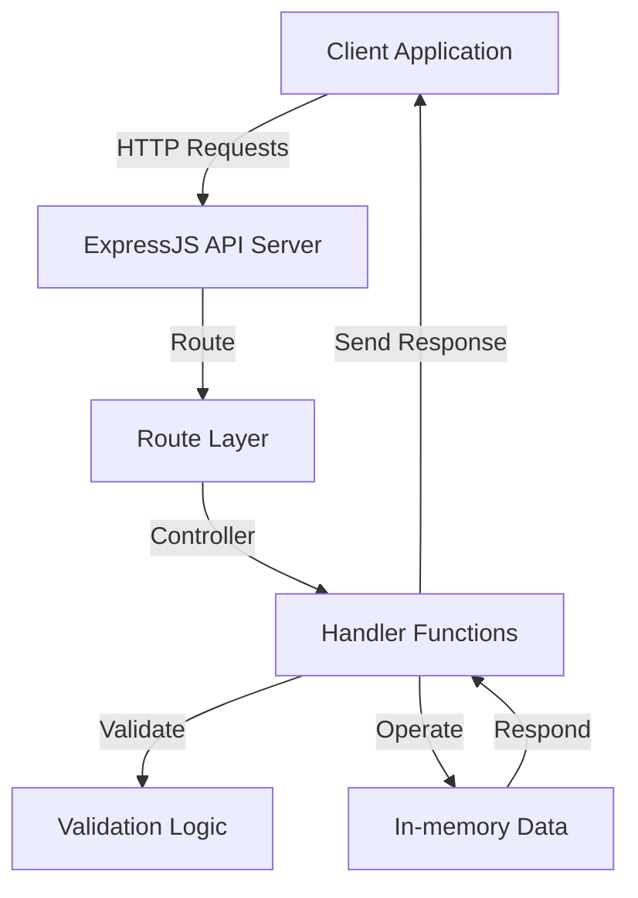

# Fundamental Notes API ExpressJS

Fundamental-NotesAPI-ExpressJS is a simple, modular RESTful API for managing notes. Built using Node.js and ExpressJS, it demonstrates fundamental backend concepts including routing, controllers, request validation, and error handling. This API is ideal for learning, prototyping, or as a starting point for more advanced note-taking or CRUD applications.

---

## Requirements

Before you begin, ensure your system meets these requirements:

- **Node.js**: v14.x or higher  
- **npm**: v6.x or higher (usually comes with Node.js)
- **Git**: For cloning the repository

To run and develop locally, you’ll need:

- A terminal or command prompt
- Internet connection to install dependencies

---

## Features

This API provides the following key features:

- **CRUD Operations for Notes**
  - Create, read, update, and delete notes through RESTful endpoints.
- **Request Validation**
  - Ensures only valid data is stored via request payload validation.
- **Modular Structure**
  - Separation of routes, handlers, and validation for maintainability and scalability.
- **Comprehensive Error Handling**
  - Consistent error responses for invalid requests or server errors.
- **JSON-based Data**
  - Uses in-memory arrays or JSON objects (no external database), perfect for demonstration and testing.
- **HTTP Status Codes**
  - Proper HTTP status codes returned for each operation.
- **Simple Configuration**
  - Easy to start and configure via environment variables or defaults.
- **Extensible Codebase**
  - Easily extend with middleware, authentication, or database support.

---

## Usage

Follow these steps to set up, run, and interact with the Notes API.

### 1. Clone and Install

Clone the repository and install dependencies:

```bash
git clone https://github.com/Rizald95/Fundamental-NotesAPI-ExpressJS.git
cd Fundamental-NotesAPI-ExpressJS
npm install
```

### 2. Start the Server

To start the server in development mode:

```bash
npm run start
```

By default, the server runs on `http://localhost:5000` (or as configured in `app.js`).

### 3. API Overview and Endpoints

You can interact with the API using tools like [Postman](https://www.postman.com/), [curl](https://curl.se/), or any HTTP client.

#### List All Notes - GET `/notes`

Retrieve all notes.

```api
{
    "title": "List All Notes",
    "description": "Fetch all stored notes.",
    "method": "GET",
    "baseUrl": "http://localhost:5000",
    "endpoint": "/notes",
    "headers": [],
    "queryParams": [],
    "pathParams": [],
    "bodyType": "none",
    "requestBody": "",
    "responses": {
        "200": {
            "description": "Success",
            "body": "{\n  \"status\": \"success\",\n  \"data\": {\n    \"notes\": [\n      { \"id\": \"note-1\", \"title\": \"First Note\", \"body\": \"Content.\" }\n    ]\n  }\n}"
        }
    }
}
```

#### Get Note by ID - GET `/notes/:id`

Retrieve a single note by its unique identifier.

```api
{
    "title": "Get Note by ID",
    "description": "Get a specific note by its ID.",
    "method": "GET",
    "baseUrl": "http://localhost:5000",
    "endpoint": "/notes/:id",
    "headers": [],
    "queryParams": [],
    "pathParams": [
        {
            "key": "id",
            "value": "Note ID",
            "required": true
        }
    ],
    "bodyType": "none",
    "requestBody": "",
    "responses": {
        "200": {
            "description": "Success",
            "body": "{\n  \"status\": \"success\",\n  \"data\": {\n    \"note\": { \"id\": \"note-1\", \"title\": \"First Note\", \"body\": \"Content.\" }\n  }\n}"
        },
        "404": {
            "description": "Not Found",
            "body": "{\n  \"status\": \"fail\",\n  \"message\": \"Note not found\"\n}"
        }
    }
}
```

#### Create Note - POST `/notes`

Add a new note.

```api
{
    "title": "Create Note",
    "description": "Add a new note to the collection.",
    "method": "POST",
    "baseUrl": "http://localhost:5000",
    "endpoint": "/notes",
    "headers": [
        {
            "key": "Content-Type",
            "value": "application/json",
            "required": true
        }
    ],
    "queryParams": [],
    "pathParams": [],
    "bodyType": "json",
    "requestBody": "{\n  \"title\": \"My Note Title\",\n  \"body\": \"The note content.\"\n}",
    "responses": {
        "201": {
            "description": "Created",
            "body": "{\n  \"status\": \"success\",\n  \"message\": \"Note added successfully\",\n  \"data\": {\n    \"noteId\": \"note-2\"\n  }\n}"
        },
        "400": {
            "description": "Bad Request",
            "body": "{\n  \"status\": \"fail\",\n  \"message\": \"Title is required\"\n}"
        }
    }
}
```

#### Update Note - PUT `/notes/:id`

Update an existing note’s title and/or body.

```api
{
    "title": "Update Note",
    "description": "Edit an existing note by its ID.",
    "method": "PUT",
    "baseUrl": "http://localhost:5000",
    "endpoint": "/notes/:id",
    "headers": [
        {
            "key": "Content-Type",
            "value": "application/json",
            "required": true
        }
    ],
    "queryParams": [],
    "pathParams": [
        {
            "key": "id",
            "value": "Note ID",
            "required": true
        }
    ],
    "bodyType": "json",
    "requestBody": "{\n  \"title\": \"Updated Title\",\n  \"body\": \"Updated content.\"\n}",
    "responses": {
        "200": {
            "description": "Success",
            "body": "{\n  \"status\": \"success\",\n  \"message\": \"Note updated successfully\"\n}"
        },
        "404": {
            "description": "Not Found",
            "body": "{\n  \"status\": \"fail\",\n  \"message\": \"Note not found\"\n}"
        }
    }
}
```

#### Delete Note - DELETE `/notes/:id`

Remove a note by its identifier.

```api
{
    "title": "Delete Note",
    "description": "Delete a specific note by its ID.",
    "method": "DELETE",
    "baseUrl": "http://localhost:5000",
    "endpoint": "/notes/:id",
    "headers": [],
    "queryParams": [],
    "pathParams": [
        {
            "key": "id",
            "value": "Note ID",
            "required": true
        }
    ],
    "bodyType": "none",
    "requestBody": "",
    "responses": {
        "200": {
            "description": "Success",
            "body": "{\n  \"status\": \"success\",\n  \"message\": \"Note deleted successfully\"\n}"
        },
        "404": {
            "description": "Not Found",
            "body": "{\n  \"status\": \"fail\",\n  \"message\": \"Note not found\"\n}"
        }
    }
}
```

---

### 4. Project Structure

This repository uses a modular directory structure for scalability and clarity:

```
.
├── routes/              # Express route definitions
├── handlers/            # Request handler functions (controllers)
├── validations/         # Payload validation logic
├── utils/               # Utility functions (e.g., ID generator)
├── data/                # In-memory data or data sources
├── app.js               # Main Express app entry point
├── package.json         # Project metadata and dependencies
└── README.md
```

---

### 5. Example Workflow

1. **Add a note** with POST `/notes`.
2. **View all notes** with GET `/notes`.
3. **Update a note** using PUT `/notes/:id`.
4. **Delete a note** using DELETE `/notes/:id`.

---

### 6. Extending the API

- **Add authentication**: Integrate JWT or session authentication.
- **Persist data**: Connect to a database like MongoDB or PostgreSQL.
- **Add more features**: Support tags, search, or user-specific notes.

---

## Architecture Diagram



---

## Summary

Fundamental-NotesAPI-ExpressJS is a beginner-friendly, modular REST API for managing notes. Use it to learn, prototype, or as a foundation for advanced Node.js Express projects. Contributions and suggestions are welcome!